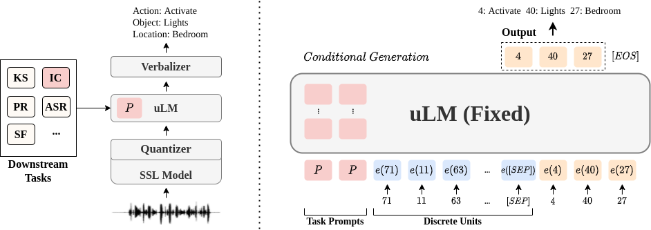

# SpeechPrompt

* Title: An Exploration of Prompt Tuning on Generative Spoken Language Model for Speech Processing Tasks

* This is the first work that explores **prompt tuning (discovered units level)** on Generative Spoken Lanugage Model (GSLM) for various **speech processing** tasks. 

* Paper Link: [https://arxiv.org/abs/2203.16773](https://arxiv.org/abs/2203.16773)

* Comment: Submitted to Interspeech 2022



## Abstract
Speech representations learned from Self-supervised learning (SSL) models have been found beneficial for various speech processing tasks.
However, utilizing SSL representations usually requires fine-tuning the pre-trained models or designing task-specific downstream models and loss functions, causing much memory usage and human labor. On the other hand, prompting in Natural Language Processing (NLP) is an efficient and widely used technique to leverage pre-trained language models (LMs). Nevertheless, such a paradigm is little studied in the speech community. We report in this paper the first exploration of the prompt tuning paradigm for speech processing tasks based on Generative Spoken Language Model (GSLM). Experiment results show that the prompt tuning technique achieves competitive performance in speech classification tasks with fewer trainable parameters than fine-tuning specialized downstream models.
We further study the technique in challenging sequence generation tasks. Prompt tuning also demonstrates its potential, while the limitation and possible research directions are discussed in this paper.

## Contributions

* We propose a unified framework based on prompt tuning for various speech processing tasks
* We achieve comparable performance with fewer trainable parameters on speech classification tasks
* We study the possibility of prompt tuning method on speech generation (speech decoding) tasks 

## Experiment Result
We comapre the proposed framework with fintuning the downstream models as in [SUPERB](https://superbbenchmark.org/leaderboard).
For speech classification tasks, it achieves a better parameter efficientcy:
* Keyword Spotting (KS): a single-label classification task
* Intent Classification (IC): a multi-label classification task


## JSALT Workshop
We will futher explore prompting and adapter on SSL models for speech processing tasks in [JSALT Workshop](https://www.clsp.jhu.edu/workshops/).

This is a project under the research topic: **Leveraging Pre-training Models for Speech Processing**

For more information, please refer to our website: https://jsalt-2022-ssl.github.io/

## Citation
```
@article{chang2022exploration,
  title={An Exploration of Prompt Tuning on Generative Spoken Language Model for Speech Processing Tasks},
  author={Chang, Kai-Wei and Tseng, Wei-Cheng and Li, Shang-Wen and Lee, Hung-yi},
  journal={arXiv preprint arXiv:2203.16773},
  year={2022}
}
```

## References
This work is mainly based on:
1. [Generative Spoken Language Model (GSLM)](https://arxiv.org/abs/2102.01192)
2. [Prefix-Tuning](https://arxiv.org/abs/2101.00190)
3. [Fairseq](https://github.com/pytorch/fairseq)
